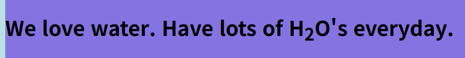
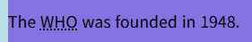

## 💻25.09.17 SUMMARY

### 📒What I learned today?

I heard "Web safe color" for the first time.
There are a lot of color chart in htmlcolorcodes.com
There are Hex code, RGB code, HSL code for color. I don't know HSL ccode so I think I should find about this.
According to professor, (I'm not sure but) RGB code and HSL code is usiing function for color so they have parameters.

We learned about font-family. Type like this! (All of these are inline styling or inline CSS)

```html
<h3 style="font-family: 'Courier New', Courier, monospace;">
  This is an example
</h3>
```

###### Formatting

I learned about formatting.

- `<b></b>`: make text bold
- `<strong></strong>` : make text bold
- `<i></i>` : italic font
- `<em></em>` : same as i
- `<mark></mark>`: highlight
- `<del></del>`: it makes horizontal line on text
- `<sub></sub>`: it makes text a little bit lower
- `<super></super>`: opposite to `sub`, it makes text a little bit higher
  For example,

`<h1>We love water. Have lots of H<sub>2</sub>O's everyday.</h1>`


###### Quotations

- `<blockquote></blockquote>`: you can use this tag for quotation

```html
<blockquote cite="https://www.w3schools.com/">
  For 60 years, WWF has worked to help people and nature thrive. As the world's
  leading conservation organization, WWF works in nearly 100 countries.
</blockquote>
```

- `<q></q>`: When you do quotation, you can use this one when you quite some sentences
- `<abbr></abbr>` : makes dotted horizontal line under the text

```html
<p>
  The <abbr title="World Health Organization">WHO</abbr> was founded in 1948.
</p>
```



### 🌟My comment

I am always surprised at the atmosphere of class, because students are really confident about themselves and feel free to question.
