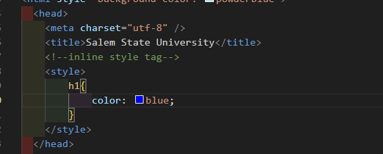
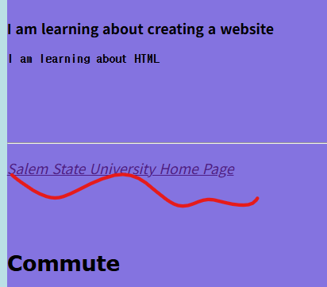
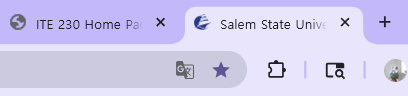
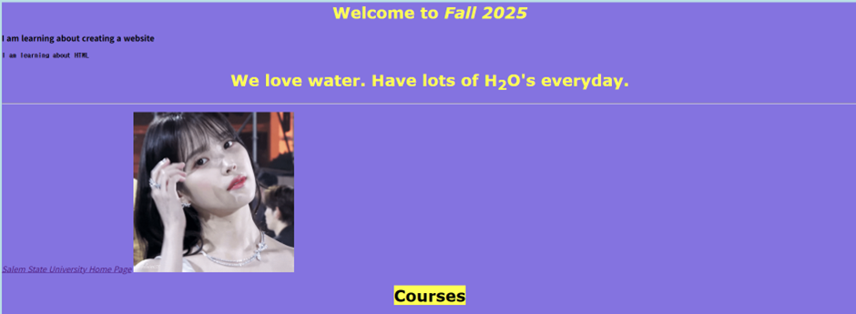
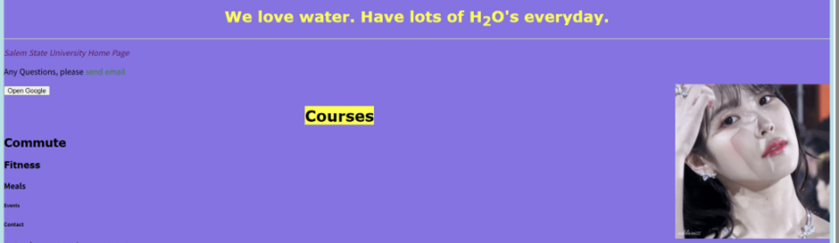

## 💻25.09.24 SUMMARY

### 📒What I learned today?

##### 09.24

First, professor reviewed types of CSS tags.

- inline CSS: put css in `html` tags, like `<body style="background-color:blue;"></body>`

- internal CSS: put CSS in html file, in the `<head></head>` tags.

```html
<head>
  <meta charset="utf-8" />
  <title>Salem State University</title>
  <!--inline style tag-->
  <style>
    h1 {
      color: blue;
    }
    body {
      background-color: aqua;
    }
  </sty>
</head>
```



- external CSS: link CSS file into html file
  I can write like this!

```html
<head>
  <meta charset="utf-8" />
  <title>Salem State University</title>
  <link rel="stylesheet" href="htmlpart4.css" />
  <!--inline style tag-->
  <!-- <style>
        h1{
            color: blue;
        }
        body{
            background-color: aqua;
        }
    </style> -->
</head>
```

if I want to make a comment in CSS file, I can use `/**/`.
Like this!

```css
/* filename: htmlpart4.css */
/* Linking this file in htmlpart4.html */
```

When we write CSS in html inline tag, we write like this (using '=')

```html

```

But if I want to write this in external CSS file, we should change '=' to ':'

```css
img {
  height: "50";
}
```

#### HTML links

the `target` attribute specifies where to open the linked document!

- `_self` - Default. Opens the document in the same window/tab as it was clicked
- `_blank` - Opens the document in a new window or tab
- `_parent` - Opens the document in the parent frame
- `_top` - Opens the document in the full body of the window

Let's try

```html
<a href="https://www.salemstate.edu/" target="_blank"
  ><em>Salem State University Home Page</em></a
>
```

If I click the link,
<br>

<br>
There is a new tab next to the original tab!
<br>


##### Absolute URLs vs Relative URLs

- Absolute Path: The full path to a file or folder starting from the root directory. It always points to the same location, no matter where you run it.
  `/home/user/docs/file.txt`

- Relative Path: The path to a file or folder relative to the current working directory. It depends on where you run it.
  `../docs/file.txt`

```html
<h2>Absolute URLs</h2>
<p><a href="https://www.w3.org/">W3C</a></p>
<p><a href="https://www.google.com/">Google</a></p>

<h2>Relative URLs</h2>
<p><a href="html_images.asp">HTML Images</a></p>
<p><a href="/css/default.asp">CSS Tutorial</a></p>
```

Also, we learned that we can use web developer tool in the browser!

##### 09.26

- HTML images
  We can make image as link by using `<a></a>` tags!

```html
<a href="htmlpart5.html"
  ></a>
```

> `id` stands for identify



If you want to change the location of image, you can use `float` attribute.

```css
#iuGif {
  height: 20rem;
  float: right;
}
```



> We can use `title` attribute to show where to go `<a href="https://www.salemstate.edu/" target="_blank" title="go to SSU hompage"><em>Salem State University Home Page</em></a>
`

🔹 I used `id` for CSS styling, and I was wondering what is the difference between `id` and `class`?
Which one is better to use?

- id

Used to uniquely identify a single element.

It must be unique within an HTML document (only one element can have that id).

Selected in CSS with #idName { ... }.

Best for targeting one specific element.

- class

Used to group multiple elements with the same style.

Can be reused across many elements, and elements can have multiple classes.

Selected in CSS with .className { ... }.

Best for applying common styles to multiple elements.

##### 👉 Which one is better?

Most of the time, using class is better because it’s reusable, flexible, and easier to maintain.
id should only be used in special cases, such as when you need to uniquely target an element (e.g., in JavaScript).

- Email
  if you want to link Email, you can use like this

```html
<p>
  Any Questions, please
  <a href="mailto:admissions@salemstate.edu">send email</a>
</p>
```

- Button

```html
<button onclick="document.location='https://www.google.com'">
  Open Google
</button>
```

- `<a>` tag styling
  We can make some `<a></a>` tag styling!

```css
a:link {
  color: green;
  background-color: transparent;
  text-decoration: none; /*remove underline*/
}
```

### 🌟My comment

##### 09.24

As I learned various tags about HTML and CSS, I want to know how browser works to read and show these codes.

##### 09.26

I could practice more about various tags. I forgot quite many things, but through this class, I think I try to remember some knowledges. I am gonna practice more by doing portfolio projects.
