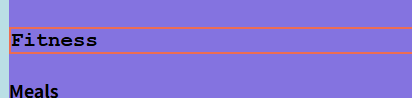
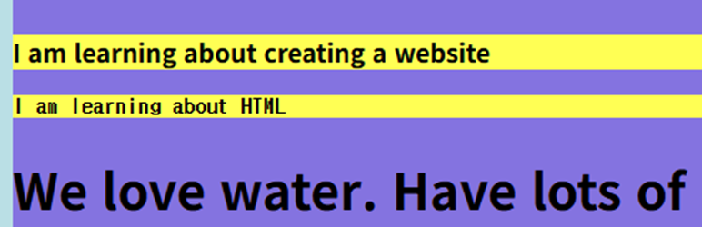
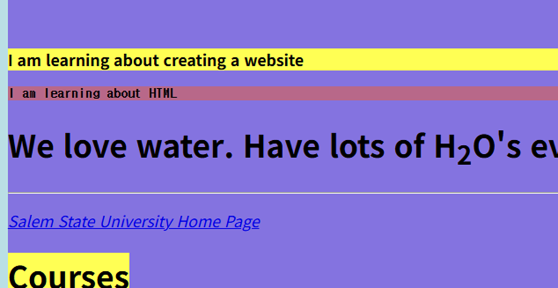

## 💻 25.09.17, 25.09.19 SUMMARY

### 📒 What I Learned Today

#### 09.17

I heard the term **"Web Safe Color"** for the first time.  
There are a lot of color charts on [htmlcolorcodes.com](https://htmlcolorcodes.com).  
I learned that colors can be represented in **Hex code**, **RGB code**, and **HSL code**.  
I don’t know much about the HSL code yet, so I think I should study it more.

According to the professor (I’m not 100% sure, but), both RGB code and HSL code are written in function form, so they use parameters.

---

We also learned about **font-family**.  
Here’s an example (this is inline styling with CSS):

```html
<h3 style="font-family: 'Courier New', Courier, monospace;">
  This is an example
</h3>
```

---

###### ✍️ Formatting

I learned about text formatting:

- `<b></b>`: makes text bold
- `<strong></strong>`: makes text bold (semantic emphasis)
- `<i></i>`: italic font
- `<em></em>`: italic font (semantic emphasis)
- `<mark></mark>`: highlights text
- `<del></del>`: draws a horizontal line through text
- `<sub></sub>`: makes text appear a little lower
- `<sup></sup>`: opposite of `sub`, makes text appear a little higher

For example:

```html
<h1>We love water. Have lots of H<sub>2</sub>O every day.</h1>
```

---

###### 📜 Quotations

- `<blockquote></blockquote>`: used for quotations

```html
<blockquote cite="https://www.w3schools.com/">
  For 60 years, WWF has worked to help people and nature thrive. As the world's
  leading conservation organization, WWF works in nearly 100 countries.
</blockquote>
```

- `<q></q>`: used for short, inline quotations
- `<abbr></abbr>`: shows an abbreviation with a dotted underline

```html
<p>
  The <abbr title="World Health Organization">WHO</abbr> was founded in 1948.
</p>
```

---

###### 🎨 What is HSL?

HSL stands for **Hue, Saturation, and Lightness**.  
It is one of the ways to define colors in CSS.

- **Hue (색상)**: a degree on the color wheel (0–360)
  - 0 = Red, 120 = Green, 240 = Blue
- **Saturation (채도)**: intensity of the color (0% = gray, 100% = full color)
- **Lightness (명도)**: brightness of the color (0% = black, 100% = white, 50% = normal)

Examples:

```css
/* Red */
color: hsl(0, 100%, 50%);

/* Pastel Blue */
color: hsl(200, 100%, 80%);

/* Gray */
color: hsl(0, 0%, 50%);
```

👉 HSL is more intuitive for humans to adjust colors compared to RGB.

---

#### 09.19

We can use `<!---->` to comment. The comments are some describtion which is for developer. The browser don't read the comments.
Also, we reviewed some knowledge related to html color that we learned last week.

##### Border Style

There are three values. `border: 2px solid tomato`
first values is boldness of line, second value is boldness of line, and the last value is color of line.

- `none`: no border
- `solid`: a single solid line
- `dashed`: a dashed line
- `dotted`: a dotted line
- `double`: two solid lines
- `groove`: a carved-in effect
- `ridge`: the opposite of groove
- `inset`: makes the box look embedded
- `outset`: makes the box look raised

```html
<h3 style="font-family:courier; border: 2px solid tomato;">Fitness</h3>
```



##### RGB color

If you want to apply transparency, you can do like this!
`rgb(255, 99, 71)` => `rgba(255, 99, 71, 0.5)` : 50% transparency
before using rgba

```html
<pre
  style="background-color: rgb(255, 79, 23);"
><strong>I am learning about HTML</strong></pre>
```


after using rgba

```html
<pre
  style="background-color: rgba(255, 79, 23, 0.5);"
><strong>I am learning about HTML</strong></pre>
```



> I can check colors here!
> https://www.w3schools.com/html/html_colors_rgb.asp

##### Hex color

- `#rrggbb` : r states red, g states green, b states blue

We start to learn CSS

##### CSS

- CSS: Cascading Style Sheets
- Cascading means that a style applied to a parent element will also apply to all children elements within the parent.
  > I find 'Cascading' in the dictionary and it means "a steep usually small fall of water".

There are three types of CSS

1. inline CSS: by using the `style` attribute inside HTML elements
2. internal CSS: by using a `<style>` element in the `<head>` section
3. external CSS: by using a `<link>` element to link an external CSS file. Styles written in a separate .css file, linked using <link rel="stylesheet" href="style.css">.

🔹 Why External CSS is the most used

- Separation of concerns (HTML = content, CSS = style)
  Keeps code clean and organized.
  Easier for developers to manage structure and design separately.
- Reusability
  A single CSS file can be linked to multiple HTML pages.
  You only write styles once, and they apply across the whole website.
- Maintainability
  If you want to change a color, font, or layout, you edit the CSS file once → the change updates everywhere.
- Faster load times
  Browsers can cache external CSS files, so after the first load, pages that use the same stylesheet will load faster.
- Scalability
  Best choice for larger projects with many pages.
  Inline and internal CSS become messy as the project grows.

### 🌟 My Comment

#### 09.17

I am always surprised by the atmosphere of class, because students are really confident in themselves and feel free to ask questions.

Also, luckily, I think my listening skills have improved! Last week, I couldn’t understand what the professor was saying, but today I could almost understand everything.

I thought I already knew HTML and CSS well, but there are still so many tags I didn’t know about. I realized I should stay humble and keep learning.

#### 09.19

There is a new project which is making a portfolio Web Site. The professor asked us which one do you prefer between doing it by a team or by alone.
I wanted to do project as a team, but as I don't have friends and the topic is hard to do together, so I choose to do it alone.
I could review my knowledge of html in today's class.
