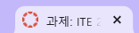
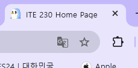
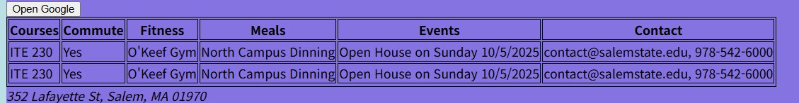
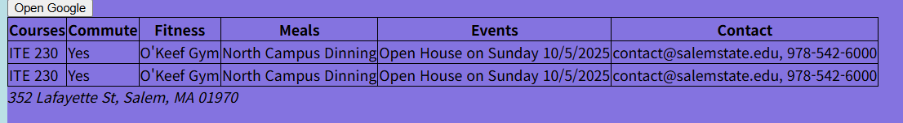

## 💻25.09.24 SUMMARY

### 📒What I learned today?

##### 10.01

- HTML Images: Image Map, Background Images, The Picture Element

##### Image Map

I learned Image Map for the first time! I didn't know this function.
I used IU and fan image, IU linked to IU official youtube channel and fan linked to Uaena fan page.
It was hard to find image coords, which is the area of the image map.
But I asked chat GPT and it told me that I can use javascript console to know the coords.

```javascript
const img = document.querySelector("#imgmapTest"); // id 선택
img.style.cursor = "crosshair";

img.addEventListener("click", (e) => {
  const rect = img.getBoundingClientRect();
  const x = Math.round(e.clientX - rect.left);
  const y = Math.round(e.clientY - rect.top);
  console.log("coords:", x, y);
});
```

I used this code in the console, and I could find the coords! It was so simple and good.

```html

<map name="map">
  <area
    shape="rect"
    coords="1054,341,1269,900"
    alt="IU official youtube"
    href="https://www.youtube.com/@dlwlrma"
    target="_blank"
  />
  <area
    shape="rect"
    coords="216,341,588,898"
    alt="IU fan page"
    href="https://jieuninus.com/"
    target="_blank"
  />
</map>
```

finally, I linked image maps!!

Also, I can repeat the images on the background.

```css
body {
  background-color: rgb(136, 114, 231);
  background-image: url("./sources/pingping.jpg");
}
```


- HTML Favicon
- HTML Page Title
- HTML Tables
- HTML Lists

##### 10.03

- Favicon
  We learned about favicon.
  A favicon is a small image for page title to be displayed nect to the browser tab
  

```html
<head>
  <meta charset="utf-8" />
  <title>ITE 230 Home Page</title>
  <link rel="icon" type="image/x-icon" href="./sources/favicon.ico" />
  <link rel="stylesheet" href="htmlpart6.css" />
</head>
```



- Table
  We can make a table by using `<table></table>`, `<tr></tr>`, `<th></th>` and `<td></td>` tags.
  > `<th></th>` means table headers, `<td></td>` means table data!
  > HTML code

```html
<table>
  <tr>
    <!-- Begin Row 1 -->
    <th>Courses</th>
    <th>Commute</th>
    <th>Fitness</th>
    <th>Meals</th>
    <th>Events</th>
    <th>Contact</th>
  </tr>
  <!-- End of row 1 -->
  <tr>
    <!-- Begin Row 2 -->
    <td>ITE 230</td>
    <td>Yes</td>
    <td>O'Keef Gym</td>
    <td>North Campus Dinning</td>
    <td>Open House on Sunday 10/5/2025</td>
    <td>contact@salemstate.edu, 978-542-6000</td>
  </tr>
  <!-- End of row 2 -->
  <tr>
    <!-- Begin Row 3 -->
    <td>ITE 230</td>
    <td>Yes</td>
    <td>O'Keef Gym</td>
    <td>North Campus Dinning</td>
    <td>Open House on Sunday 10/5/2025</td>
    <td>contact@salemstate.edu, 978-542-6000</td>
  </tr>
  <!-- End of row 3 -->
  <tr></tr>
</table>
```

Styling

```css
table,
th,
td {
  border: 1px solid black;
  border-collapse: collapse;
}
```

Before Border collpase

After Bordr collpase


When we style the table, `border: 1px solid black;`
First one is thickness, second one is style, third one is color of the border.
Also, you can make property separately.
Like this!

```css
td {
  border-width: 1px;
  border-style: solid;
  border-color: black;
}
```

You can hide border by using `none` property, too!

If you want to make vertical table, you can do like this

```html
<table>
  <tr>
    <!-- Begin Row 1 -->
    <th>Courses</th>
    <td>Commute</td>
    <td>Fitness</td>
    <td>Meals</td>
    <td>Events</td>
    <td>Contact</td>
  </tr>
  <!-- End of row 1 -->
  <tr>
    <!-- Begin Row 2 -->
    <th>ITE 230</th>
    <td>Yes</td>
    <td>O'Keef Gym</td>
    <td>North Campus Dinning</td>
    <td>Open House on Sunday 10/5/2025</td>
    <td>contact@salemstate.edu, 978-542-6000</td>
  </tr>
  <!-- End of row 2 -->
  <tr>
    <!-- Begin Row 3 -->
    <th>ITE 230</td>
    <td>Yes</td>
    <td>O'Keef Gym</td>
    <td>North Campus Dinning</td>
    <td>Open House on Sunday 10/5/2025</td>
    <td>contact@salemstate.edu, 978-542-6000</td>
  </tr>
  <!-- End of row 3 -->
  <tr></tr>
</table>
```

### 🌟My comment

##### 10.01

Of course the knowledge that I learned today will be not used often in the future, especially while working, but it was fun to learn various tags that I didn't know.

##### 10.03

I learned about Favicon and table! I think I should practice more to make table, because I forgot how to decorate them. It was fun to make table!
