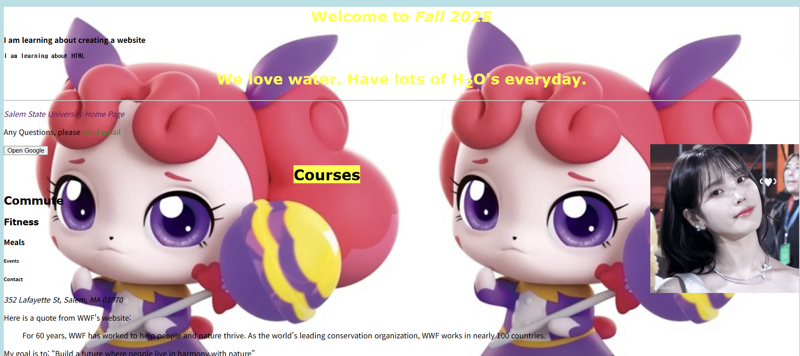

## 💻25.09.24 SUMMARY

### 📒What I learned today?

##### 10.01

- HTML Images: Image Map, Background Images, The Picture Element

##### Image Map

I learned Image Map for the first time! I didn't know this function.
I used IU and fan image, IU linked to IU official youtube channel and fan linked to Uaena fan page.
It was hard to find image coords, which is the area of the image map.
But I asked chat GPT and it told me that I can use javascript console to know the coords.

```javascript
const img = document.querySelector("#imgmapTest"); // id 선택
img.style.cursor = "crosshair";

img.addEventListener("click", (e) => {
  const rect = img.getBoundingClientRect();
  const x = Math.round(e.clientX - rect.left);
  const y = Math.round(e.clientY - rect.top);
  console.log("coords:", x, y);
});
```

I used this code in the console, and I could find the coords! It was so simple and good.

```html

<map name="map">
  <area
    shape="rect"
    coords="1054,341,1269,900"
    alt="IU official youtube"
    href="https://www.youtube.com/@dlwlrma"
    target="_blank"
  />
  <area
    shape="rect"
    coords="216,341,588,898"
    alt="IU fan page"
    href="https://jieuninus.com/"
    target="_blank"
  />
</map>
```

finally, I linked image maps!!

Also, I can repeat the images on the background.

```css
body {
  background-color: rgb(136, 114, 231);
  background-image: url("./sources/pingping.jpg");
}
```



- HTML Favicon
- HTML Page Title
- HTML Tables
- HTML Lists

### 🌟My comment

##### 10.01

Od course the knowledge that I learned today will be not used often in the future, especially while working, but it was fun to learn various tags that I didn't know.
