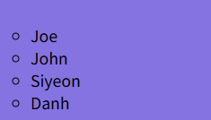

## 💻25.09.24 SUMMARY

### 📒What I learned today?

##### 10.08

If I use `margin:auto;` it is always being center, so really convenient!

```css
table {
  width: 70%;
  height: 70%;
  margin: auto;
}
```

Professor explains about the concept of padding, margin. This is the way of making some empty space between contents.

- Padding
  I can make the space for the content by using padding.

```css
example {
  padding: 1rem 1rem 1rem 1rem;
}
```

I can write like this, this sequence means top padding, right padding, bottom padding, left padding.

```css
example {
  padding: 1rem 1rem;
}
```

If I write like this, bottom and left padding will follow browser default property.

- Margin
  I can make some space between contents each other by using margin.

- Zebra looking effect

```css
/*zebra looking effect for rows*/
tr:nth-child(even) {
  background-color: rgb(109, 167, 167);
}
```

If I write like this, only the background color of the even number rows are changed.

- Ordered List, Unordered list

```html
<!--ordered list-->
<h1>Ordered List</h1>
<ol>
  <li>Joe</li>
  <li>John</li>
  <li>Siyeon</li>
  <li>Danh</li>
</ol>
<hr />
<!--unordered list-->
<ul>
  <li>Joe</li>
  <li>John</li>
  <li>Siyeon</li>
  <li>Danh</li>
</ul>
```

##### 10.10

We learn about how to style the lists
There are disc, circle, square, none in style type.
`list-style-type:circle;` I can write like this
These are for unordered lists styling

- disc
  
- circle
  
- square
  
- none
  

These are for ordered lists styling

- type="1"
- type="A"
- type="i"

- Block level tags add space on 4sides
- inline tags
- <p> VS <div>
- <span> tag

### 🌟My comment

##### 10.08 ~ 10.10

I learned basic things about lists. Also, we learned margin and padding, which is really important for styling.
