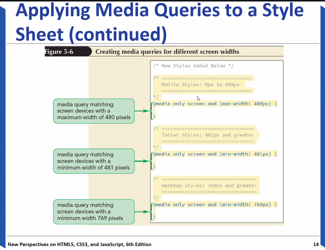

## 💻25.09.24 SUMMARY

### 📒What I learned today?

##### 10.29

- Float layout
- Flexbox layout
- Grid layout
- HTML Responsice Web Design
  `<meta name="viewport" content="width=device-width, initial-scale=1.0"`
  This will set the viewport of out page, which will gibe the browser instructions on how to control the page's dimension and scaling.

- Responsive img size

```css
img {
  max-width: 100%;
  height: auto;
  float: right;
}
```

We can make img responsivly to the device size!

- Responsive font size
  we can use `vw`

- Media querys and device features
  

  ```css
  /*Using @media query to define different styles for 3 screen sizes
  @media only screen and (max-width:480px) for mobile device
  @media only screen and (min-width: 481px) for Tablet
  @media only screen and (min-width: 769px) desktop or laptop
  */
  /*@media style for all 3 screens*/
  @media only screen and (max-width: 800px) {
    /*define styles for all screens*/
    h3 {
      color: blue;
    }
  }
  ```

##### 10.31

### 🌟My comment

##### 10.29

I was gonna study media query by myself, but we learned today! It was interesting and amazing.

##### 10.31
