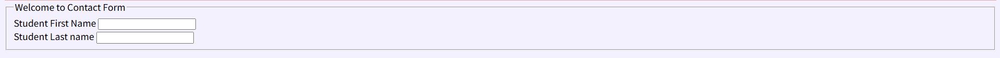
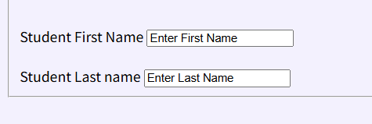
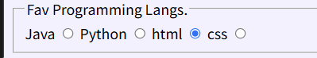
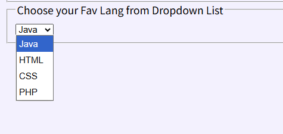

## 💻25.09.24 SUMMARY

### 📒What I learned today?

##### 11.05

- html forms
  :it is used to collect user input
  `<form></form>`: container for different types of input elements

  There are various input element!
  `<input type="text">`
  `<input type="checkbox">`
  `<input type="submit">`
  `<input type="button">`

``html

<form>
  <label for="fname">First name:</label> 
  <input type="text" id="fname" name="fname"> 
</form>
``

If I do like below code,
``html

<form>
      <fieldset>
        <legend>Welcome to Contact Form</legend>
        <!-- <h1>Welcome to Contact Form</h1> -->
        <label for="sfname">Student First Name</label>
        <input type="text" id="sfname" name="sfname" />
         
        <label for="slname">Student Last name</label>
        <input type="text" id="slname" name="slname" />
      </fieldset>
    </form>
``
The result is like this image!

Also, if I add value element, `<input type="text" id="slname" name="slname" value="Enter Last Name" />`
It became like this!

- radio button
``html
<fieldset>
        <!--Radio buttons, name attribute must be same for All input tags-->
        <legend>Fav Programming Langs.</legend>
        <label>Java</label>
        <input type="radio" name="fav-lang" />
        <label>Python</label>
        <input type="radio" name="fav-lang" />
        <label>html</label>
        <input type="radio" name="fav-lang" />
        <label>css</label>
        <input type="radio" name="fav-lang" />
      </fieldset>
``

I can make radio button by using this code. But if I don't put name of them as same, I can click all of them!
As I set the name as "fav-lang" now, I can only choose one option among them.

- drop boxes
``html
<fieldset>
        <!-- Creating drop down boxes -->
        <legend>Choose your Fav Lang from Dropdown List</legend>
        <select name="fav_lang">
          <option value="Java">Java</option>
          <option value="HTML">HTML</option>
          <option value="CSS">CSS</option>
          <option value="PHP">PHP</option>
        </select>
      </fieldset>
``

##### 11.07

### 🌟My comment

##### 11.05

Actually, I thought forms part is not that important, but we use forms everywhere when we use web site, so I thought I should know this and study a lot.
I think I should practice more!

##### 11.07
