## 💻25.09.24 SUMMARY

### 📒What I learned today?

##### 11.12

If I don't write anything here, the method will be "get".
`<form action="feedback.php" method="post">`

If I don't write email form, this message appears.
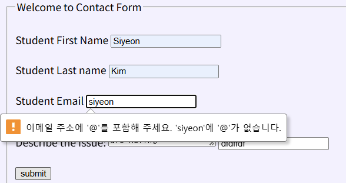

Code:
`contactform.html`

```html
<!-- filename: contactform.html -->
<!DOCTYPE html>
<html lang="en">
  <head>
    <meta charset="UTF-8" />
    <meta name="viewport" content="width=device-width, initial-scale=1.0" />
    <title>Contact form</title>
    <link rel="stylesheet" href="contactform.css" />
  </head>
  <body>
    <header>
      <!-- Create a Nav bar using lists -->
      <nav>
        <ul>
          <li><a href="htmlpart6.html">Home</a></li>
          <li><a href="#course">Courses</a></li>
          <li><a href="#students">Students</a></li>
          <li><a href="address">Address</a></li>
        </ul>
      </nav>
    </header>
    <!-- Contact form -->
    <form action="feedback.php" method="post">
      <fieldset>
        <legend>Welcome to Contact Form</legend>
        <br />
        <!-- <h1>Welcome to Contact Form</h1> -->
        <label for="sfname">Student First Name</label>
        <input
          type="text"
          id="sfname"
          name="sfname"
          placeholder="Enter First Name"
          required
        />
        <br /><br />
        <label for="slname">Student Last name</label>
        <input
          type="text"
          id="slname"
          name="slname"
          placeholder="Enter Last Name"
          required
        />
        <br /><br />
        <label for="email">Student Email</label>
        <input
          type="email"
          id="semail"
          name="semail"
          placeholder="Enter Your Email"
          required
        />
        <br /><br />
        <label for="des">Describe the Issue:</label>
        <textarea required="">Write the issue you are having</textarea>
        <input type="textarea" id="des_issue" name="des_issue" />
        <br /><br />
        <input type="submit" value="submit" />
      </fieldset>
      <fieldset>
        <!--Radio buttons, name attribute must be same for All input tags-->
        <legend>Fav Programming Langs.</legend>
        <input type="radio" name="fav-lang" />
        <label>Java</label>
        <input type="radio" name="fav-lang" />
        <label>Python</label>
        <input type="radio" name="fav-lang" />
        <label>html</label>
        <input type="radio" name="fav-lang" />
        <label>css</label>
      </fieldset>
      <fieldset>
        <!--Check boxes-->
        <legend>Fav Programming Langs.</legend>
        <input type="checkbox" name="fav-j" />
        <label>Java</label>
        <input type="checkbox" name="fav-p" />
        <label>Python</label>
        <input type="checkbox" name="fav-h" />
        <label>html</label>
        <input type="checkbox" name="fav-c" />
        <label>css</label>
      </fieldset>

      <fieldset>
        <!-- Creating drop down boxes -->
        <legend>Choose your Fav Lang from Dropdown List</legend>
        <select name="fav_lang">
          <option value="Java">Java</option>
          <option value="HTML" selected>HTML</option>
          <option value="CSS">CSS</option>
          <option value="PHP">PHP</option>
        </select>
      </fieldset>
    </form>
  </body>
</html>
```

`feedback.php`

```php
<!-- Path for testing in browser -->
<!-- Destination: http://localhost/ite230home/feedback.php-->
<!-- Source: http://localhost/ite230home/contactform.html -->
<?php
// Data in the contactform.html is saved in
// superglobal arrays $_Get[], $post[]
// when method=post, data is saved in $_post[]
// when method=get, data is saved in $_get[]
// create a local php variable to save student firstname
$stufname = $_POST["sfname"];
$stulname = $_POST["slname"];
$issue = $_POST["des_issue"];
$stuemail = $_POST["semail"];
 echo "You Entered STU First name is: $stufname<br>";
 echo "Student Last Name is: $stulname<br>";
 echo "Description of the issue is $issue<br>";
 echo "Your email is $stuemail<br>";
 echo "Thank you for contacting us $stufname";
?>
```

Result:
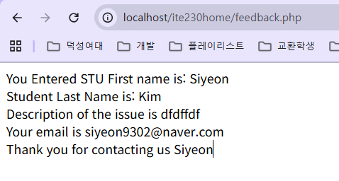

- PHP: validate
  I can check whether the name was written in right form!

```php
<!-- Path for testing in browser -->
<!-- Destination: http://localhost/ite230home/feedback.php-->
<!-- Source: http://localhost/ite230home/contactform.html -->
<?php
// Data in the contactform.html is saved in
// superglobal arrays $_Get[], $post[]
// when method=post, data is saved in $_post[]
// when method=get, data is saved in $_get[]
// create a local php variable to save student firstname
$stufname = $_POST["sfname"];
$stulname = $_POST["slname"];
$issue = $_POST["des_issue"];
$stuemail = $_POST["semail"];
 echo "You Entered STU First name is: $stufname<br>";
 // Validate Student First name
 if(!preg_match("/^[a-zA-Z-' ]*$/", $stufname)) {
  $nameFErr = "Only letters and white space allowed in First Name";
  echo "<br>First Name Error".$nameFErr."<br>";
 }
 // Validate Student Last name
 if(!preg_match("/^[a-zA-Z-' ]*$/", $stulname)) {
  $nameLErr = "Only letters and white space allowed in Last Name";
  echo "<br>Last Name Error".$nameLErr."<br>";
 }
 echo "Student Last Name is: $stulname<br>";
 echo "Description of the issue is $issue<br>";
 echo "Your email is $stuemail<br>";
 echo "Thank you for contacting us $stufname";
?>
```

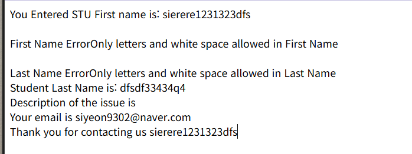

We learn about Database and MySQL!

- MySQL is a database system used on the web

`SELECT LastName FROM Employees`
: The query above selects all the data in the "LastName" column from the "Employees" table.

- Making database
  start MySQL service in XAMPP Control Pannel
  Open Browser
  `localhost/phpmyadmin`

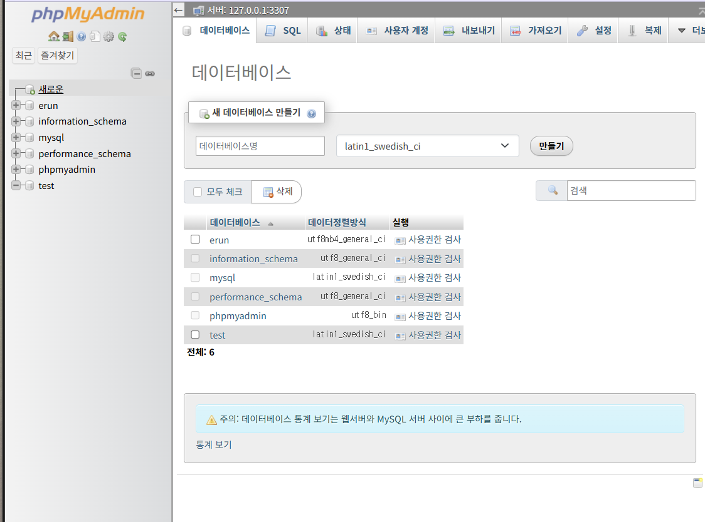

And we write this code!

```SQL
CREATE TABLE studenttb(
	stuId int AUTO_INCREMENT PRIMARY KEY,
    stuFirstName varchar(100),
    stuLastName varchar(200),
    stuEmail varchar(300),
    stuIssue varchar(1000)
);
```

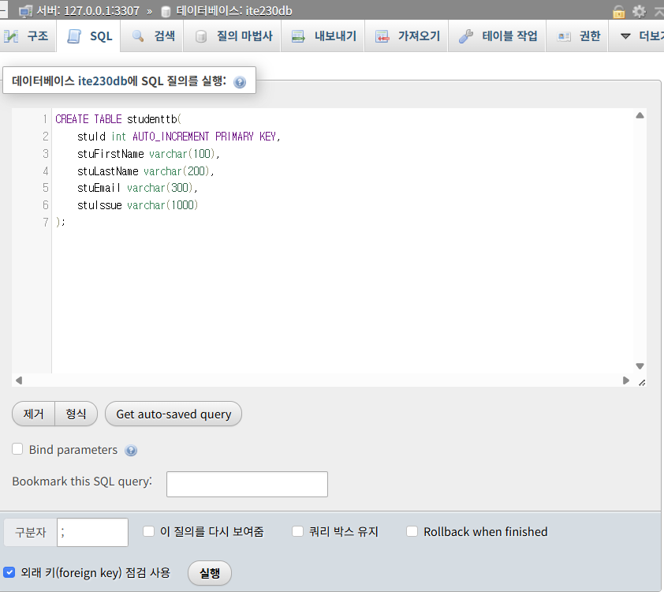

I can see new table!
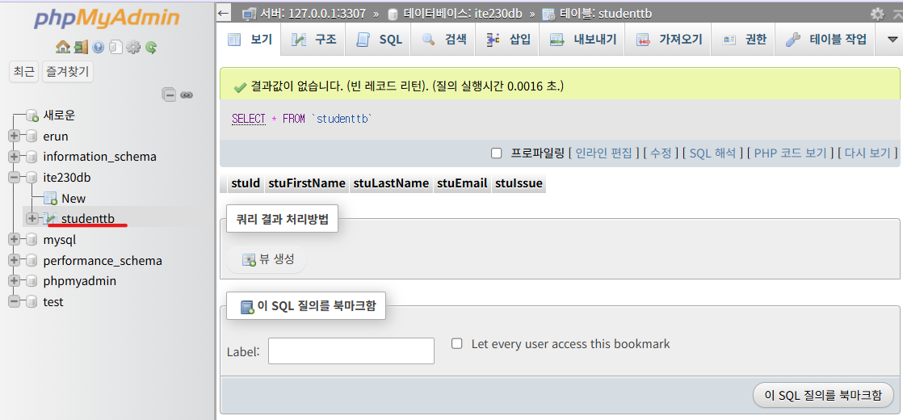

I can see the structure too!
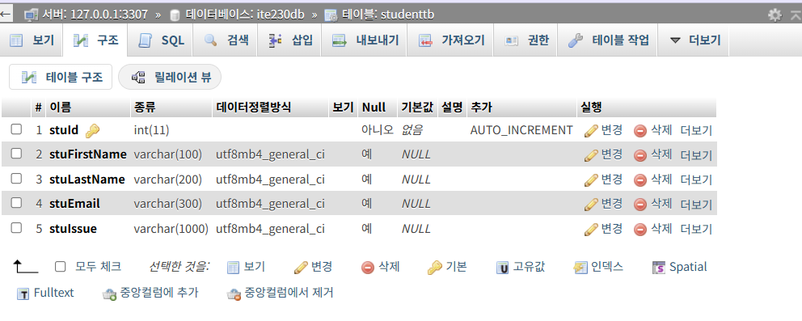

- We are making table

```SQL
INSERT INTO studenttb
VALUES(1,'Siyeon','Kim','siyeon9302@naver.com','I am hungry');
```

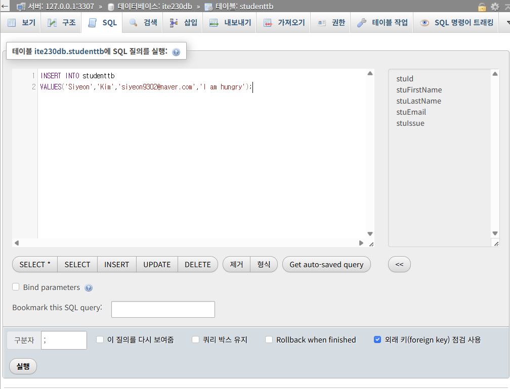

- New User!
  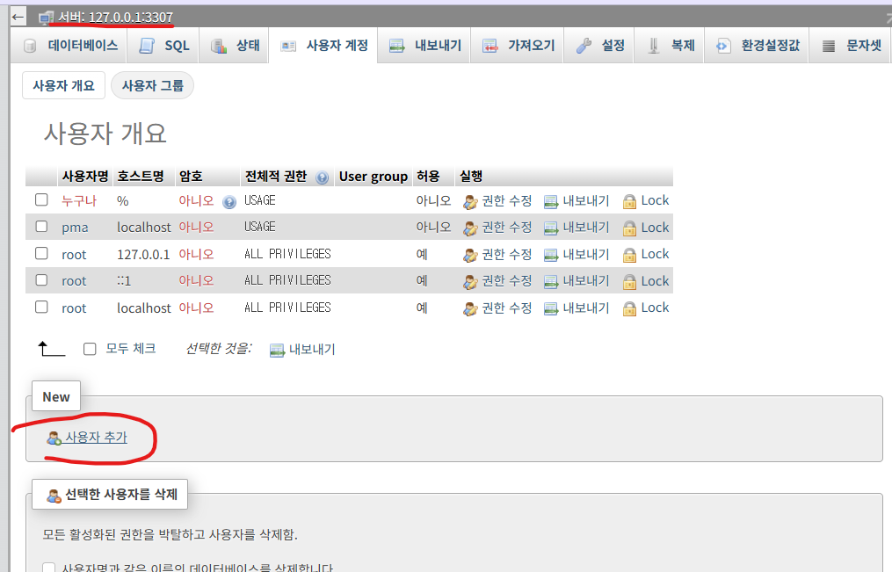

If I push generate button, it automatically generates password.
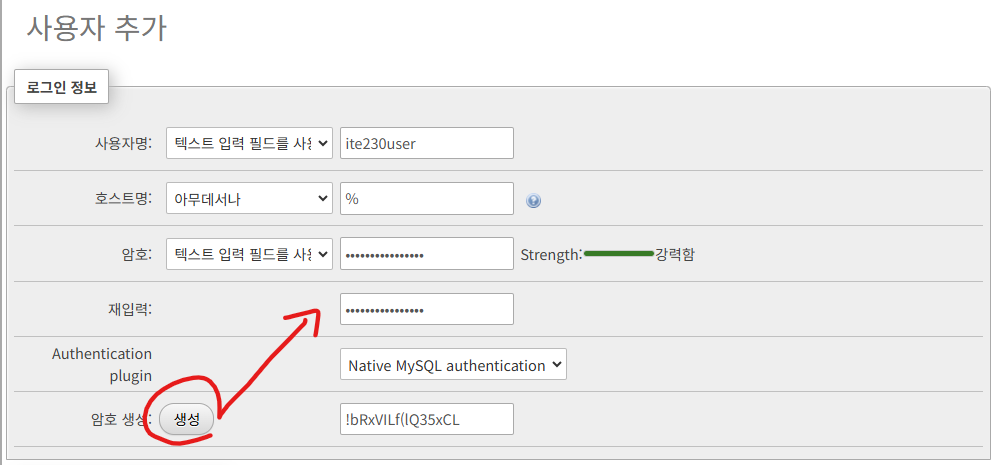

And then, give user permission
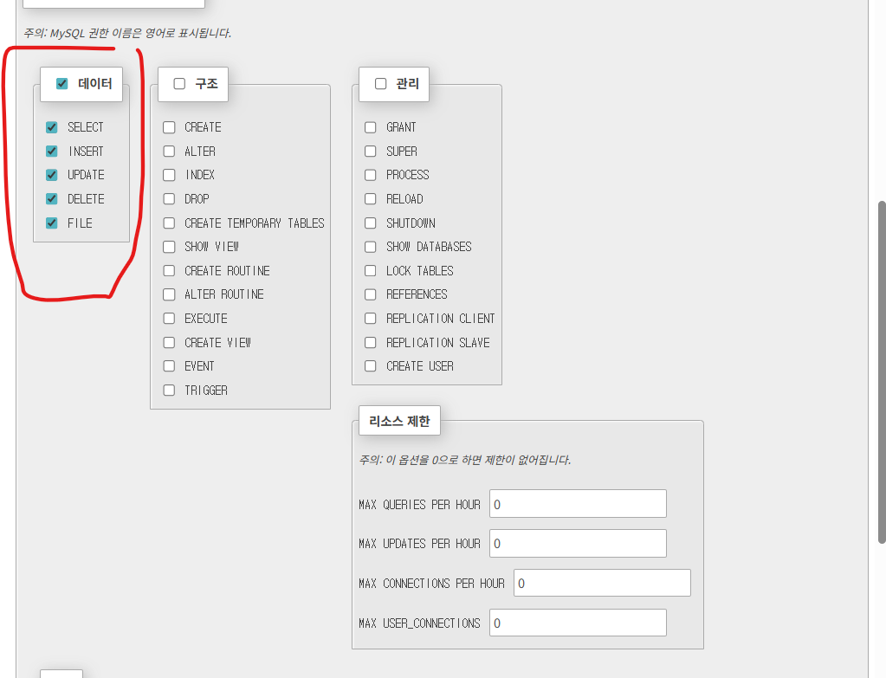

##### 11.14

### 🌟My comment

##### 11.12

I was really focused on today's class because we learned many things, especially about php and MySQL! It was my first time to make database table, so it was interesting.

##### 11.14
